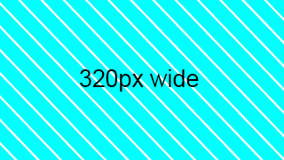

# Week 2 Class Notes

## Responsive Pictures theory

[Responsive Pictures theory](./week-2/responsive-pictures-theory.md)

## Demo Images

This set of images is arranged by maximum width. The heights are not necessarily proportional to real-world screens. The vertical images are simply rotated version of the horizontal ones.

All images have diagonal cyan stripes to better be able to see pixelation if the wrong resolution image is being displayed. 

[The zip archive of the images can be downloaded by clicking this link.](./week-2/responsive-images.zip)

## Exercise 1: Orientation

1. Open a new VS Code window.
2. Create a new folder called "orientation".
3. Create a new HTML document inside the folder.
4. Save the file as "index.html".
5. Use the !-tab Emmet shortcut to add the basic HTML template.
6. Copy a horizontal and vertical image to the same folder.
7. Use code based on this example:

        <picture>
            <source media="(orientation: landscape)" srcset="./horizontal.png">
            <source media="(orientation: portrait)" srcset="./vertical.png">
            
        </picture>

8. Open the page in the web browser.
9. Change the size of the browser window to see if the images change automatically.

## Exercise 2: Resolution

1. Open a new VS Code window.
2. Create a new folder called "resolution".
3. Create a new HTML document inside the folder.
4. Save the file as "index.html".
5. Use the !-tab Emmet shortcut to add the basic HTML template.
6. Add this code inside the \<head> tag:

        

7. Copy one horizontal image, but with different pixel widths, to the same folder.
8. Make sure the file name reflects the pixel width, ex: 1600-horizontal.jpg
9. Use code based on this example:

        <picture>
            <source media="(min-width: 800px)" srcset="./1600-horizontal.png">
            <!-- The media query for widest viewport must be written first for this to work properly -->

            <source media="(min-width: 400px)" srcset="./800-horizontal.png">
            
        </picture>

10. Open the page in the web browser.
11. Change the width of the browser window to see if the images change automatically.

## Exercise 3: Resolution with srcset (auto select by the browser)

<blockquote>

### Reference Material

[https://html.com/attributes/img-srcset/](https://html.com/attributes/img-srcset/)

</blockquote>

1. Open a new VS Code window.
2. Create a new folder called "srcset".
3. Create a new HTML document inside the folder.
4. Save the file as "index.html".
5. Use the !-tab Emmet shortcut to add the basic HTML template.
6. Add this code inside the \<head> tag:

        

7. Copy one horizontal image, but with multiple pixel widths, to the same folder.
8. Make sure the file name reflects the pixel width, ex: 1600-horizontal.jpg
9. Use code based on this example:

        <picture>
            <source srcset="
            ./2048-horizontal.png 2048w,
            ./1920-horizontal.png 1920w,
            ./1600-horizontal.png 1600w,
            ./1440-horizontal.png 1440w,
            ./1280-horizontal.png 1280w,
            ./1152-horizontal.png 1152w,
            ./1024-horizontal.png 1024w,
            ./960-horizontal.png 960w,
            ./800-horizontal.png 800w,
            ./640-horizontal.png 640w,
            ./480-horizontal.png 480w">
            <!-- The media query for widest viewport must be written first for this to work properly -->

            
        </picture>

10. Open the page in the web browser.
11. Change the width of the browser window to see if the images change automatically.

<blockquote>    

### Tip

To find the currently loaded source (when the size is not written on the picture) do this:

1. Right-click on the image and inspect it
2. DevTools will open
3. Hit the Escape key to open the console
4. Type: $0.currentSrc
5. Hit return
6. The currently loaded source image path will be displayed

</blockquote>