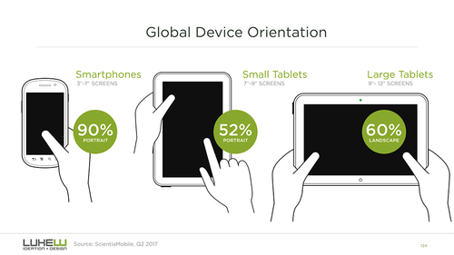
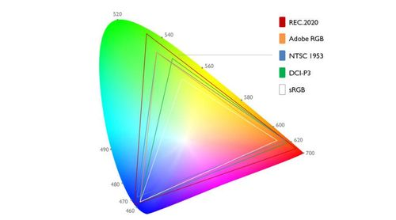
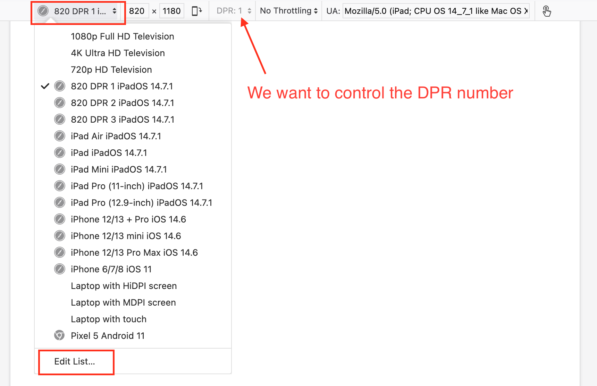
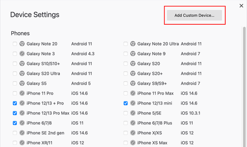
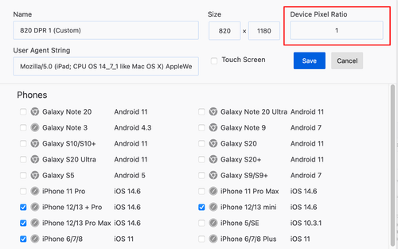
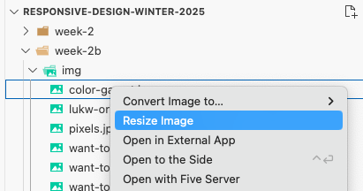
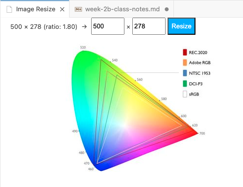

# Responsive Images using the Sizes attribute

## Objective of Responsive Images

To efficiently deliver an image that is adapted to the technical display characteristics—such as orientation, color, resolution, pixel density, and color depth—of any particular device.

- Orientation: Portrait or Landscape
- Color: Black and white, grayscale, color.
- Resolution: the overall pixel dimensions of the device. Ex: 768 x 1024
- Pixel density of the screen: 1x, 2x 3x or 4x
- Color depth: sRGB, Display P3, HDR 

[https://www.lukew.com/about/](https://www.lukew.com/about/)
  

### Getting to know your Screen

Start by checking out the characteristics of your device screen here: [https://www.mydevice.io/](https://www.mydevice.io/)

### Examples

- 1 DPR device = P-307 smartboard
- 2 DPR device = P-307 workstation monitor
- 3 DPR device = many smartphones

| Type          | Name          | Viewport Size | Device Resolution | Screen Size   | Pixel Ratio   | Density PPI    | CSS PPI |
| ------------- | ------------- | ------------- | ----------------- | ------------- | ------------- |  ------------- | ------- |
| Tablet | Apple iPad Air (2020) | 820 x 1180 | 1640 x 2360 | 10.9″ | 2.0 | 264 | 132 | 
| Tablet | Apple iPad Mini | 768 x 1024 | 1536 x 2048 | 7.9″ | 2.0 | 324 | 162 | 
| Mobile | Apple iPad Pro 11" | 834 x 1194 | 1668 x 2388 | 11.0″ | 2.0 | 264 | 132 | 
| Tablet | Apple iPad Pro 12.9" | 1024 x 1366 | 2048 x 2732 | 12.9″ | 2.0 | 264 | 132 | 
| Mobile | Apple iPhone 11 | 414 x 896 | 828 x 1792 | 6.1″ | 2.0 | 326 | 163 | 
| Mobile | Apple iPhone 11 Pro | 375 x 812 | 1125 x 2436 | 5.8″ | 3.0 | 458 | 153 | 
| Mobile | Apple iPhone 11 Pro Max | 414 x 896 | 1242 x 2688 | 6.5″ | 3.0 | 458 | 153 | 
| Mobile | Apple iPhone 12 | 390 x 844 | 1170 x 2532 | 6.1″ | 3.0 | 460 | 153 | 
| Mobile | Apple iPhone 12 mini | 360 x 780 | 1080 x 2340 | 5.4″ | 3.0 | 476 | 159 | 
| Mobile | Apple iPhone 12 Pro | 390 x 844 | 1170 x 2532 | 6.1″ | 3.0 | 460 | 153 | 
| Mobile | Apple iPhone 12 Pro Max | 428 x 926 | 1284 x 2778 | 6.7″ | 3.0 | 458 | 153 | 
| Mobile | Apple iPhone 13 | 390 x 844 | 1170 x 2532 | 6.1″ | 3.0 | 460 | 153 | 
| Mobile | Apple iPhone 13 mini | 360 x 780 | 1080 x 2340 | 5.4″ | 3.0 | 476 | 159 | 

## Setting up the web browser for Density Pixel Ratio testing

First of all a definition from [Peter-Paul Koch](http://www.quirksmode.org/about/)

" Device Pixel Ratio is the ratio between physical pixels and device-independent pixels (dips) on the device.
Device Pixel Ratio = physical pixels / dips "

- [http://www.quirksmode.org/blog/archives/2012/06/devicepixelrati.html](http://www.quirksmode.org/blog/archives/2012/06/devicepixelrati.html)

In very simplified terms, a pixel in CSS (ex: 1px) is not necessarily equal to a physical pixel built into a computer screen. 

- If the device (phone, tablet, monitor, tv, projector screen, etc) has a DPR of 1 then a CSS pixel is equal to a screen pixel.
- If the device has a DPR of 2 then a CSS pixel is equal to four screen pixels (2 wide X 2 tall = 4 total).
- If the device has a DPR of 3 then a CSS pixel is equal to nine screen pixels (3 wide X 3 tall = 9 total).
- If the device has a DPR of 4 then a CSS pixel is equal to sixteen screen pixels (4 wide X 4 tall = 16 total).

### Customize the Dev Tools

### Easily Resize Images

You can easily resize images directly with VS Code using the **n3rds-inc.image** extension.

<blockquote>    

### How to Find Which File is the Currently Loaded Image 

To find the currently loaded source (when the size is not written on the picture) do this:

1. Right-click on the image and inspect it
2. DevTools will open
3. Hit the Escape key to open the console
4. Type: $0.currentSrc
5. Hit return
6. The currently loaded source image path will be displayed

</blockquote>

## Sizes Demo

[HTML 5 Picture tag demo using the size attribute](./week-2b/sizes-demo.html)

## References

<blockquote>

### CSS Box Sizing

CSS Box Sizing is a "fix" added to newer versions of CSS. In the initial version of CSS, with total width of a box would grow once you added things like padding and borders. *This was very unintuitive, and very confusing for designers.* 

##### box-sizing: content-box;

For example, a div with a width: 600px; in the CSS would actually be **634px wide** if you gave it padding of 1rem (16px each for the left and right value = 32px) and a 1px border (1px on the left and right sides = 2px total).

This behavior is called "content-box" because the width of the text content inside the box stays at 600px.

##### box-sizing: border-box;

The "fix" is a CSS one-liner: box-sizing: border-box;

When using this in your CSS, the overall width of the box remains constant (ex: 600px) even when adding extra parameters like padding and borders.

[https://www.w3schools.com/css/css3_box-sizing.asp](https://www.w3schools.com/css/css3_box-sizing.asp)

</blockquote>

<blockquote>

### How to Use HTML5 “picture”, “srcset”, and “sizes” for Responsive Images

[https://webdesign.tutsplus.com/quick-tip-how-to-use-html5-picture-for-responsive-images--cms-21015t](https://webdesign.tutsplus.com/quick-tip-how-to-use-html5-picture-for-responsive-images--cms-21015t)

</blockquote>

