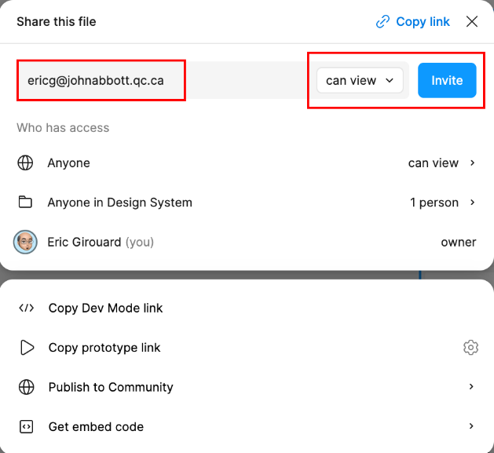

# Week 5 Class Notes

## Review

            <picture>
             <source srcset="
                img/picture-1000.jpg 1000w,
                img/picture-500.jpg 5000w"
                sizes="500px">

            
            </picture>

- The HTML **picture tag sizes attribute** is like the frame you place on an InDesign page to hold a picture. It represents **the size you want the image to be**.
- Starting with the size written in the attribute you need:
  - The first image in the srcset at double the amount of the attribute value (2x).
  - The second image at the same size as the attribute value (1x).
- In common practice, there is rarely a need to make responsive images at greater than 2x the pixel density as the human eye cannot see he difference.
- Repeat this pattern for both portrait and landscape.

## UI/UX Design Software

There are two main UI/UX design softwares (and many others): Adobe XD ("Experience Design") and Figma. Figma is the more popular of the two.

Adobe tried to buy Figma (the company), but was prevented from doing so as Adobe already has quite the monopoly in design software. So, at the time of this writing, [Adobe XD is in "maintenance mode"](https://www.creativebloq.com/news/future-of-adobe-xd). It is no longer being actively developed.  

So, please go to create a [free account at Figma](https://www.figma.com/).

You can still use XD, they are quite similar in many ways.

## Screenshot software

In the labs, we use [Flameshot](https://flameshot.org/) as a screen capture tool. It is available for macOS, Windows and Linux. It is free.

## Layout Columns

Web sites and apps, like in print design, are often created on top of a grid system. See the (really old): [960 Grid System web site](https://960.gs/)

In Figma, create the following artboards:

- A smartphone artboard (portrait)
- A smartphone artboard (landscape)
- A tablet artboard (portrait)
- A tablet artboard (landscape)
- A desktop artboard (portrait)
- A desktop artboard (landscape)

Add layout columns on each. (4, 8 or 12 columns depending on size, for example).

See: [15 minute Figma crash course](https://www.youtube.com/watch?v=jQ1sfKIl50E)

<blockquote>

### Note

Both Adobe XD and Figma have mobile app versions so you can look at your designs on a real device.

</blockquote>

## Assignment

1. Create two sets of the artboards above.
2. Take screen captures of the [CBC News web site](https://www.cbc.ca/news) at each of the different viewport sizes mentioned above.
3. Paste the screenshot on the artboard.
4. Scale the screenshot to fit the columns.
5. Tweak the number of columns (and the gutter and margins widths if necessary) to make the page's main layout boxes line up with the column guides.
6. Repeat for each artboard.
7. Repeat steps 3 to 5 for a web site that you particularly like the style of.
8. Send me an invitation to view your file by clicking the big blue share button at top right.
   
   