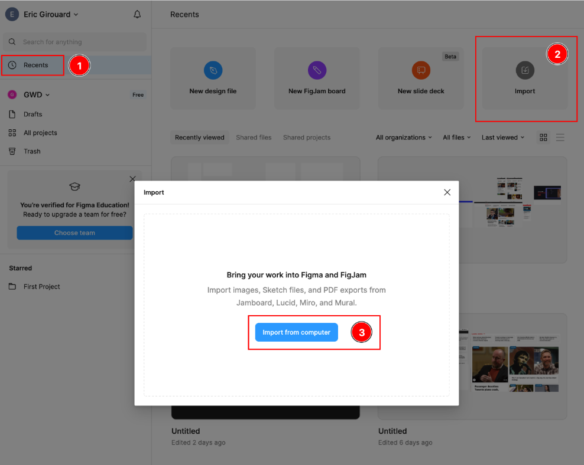
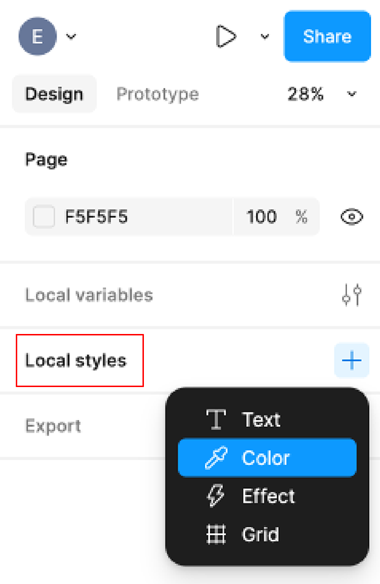

# Week 6 Class Notes

Here are the links to last Winter semester’s online Google Photo Student galleries:

 
## Last Year's "Sustainability Projects"

### BioBlitz 2024 (Digital Photo II)

Last year’s BioBlitz involved areas other than John Abbott, i.e. McGill’s Morgan Arboretum, this year it will only include the John Abbott campus.

We can improve JAC community buy-in with online promotion on JAC’s video displays, on the web and on Instagram.

[https://photos.app.goo.gl/SVXD1CQSn86jKHuD6](https://photos.app.goo.gl/SVXD1CQSn86jKHuD6)

### Earth Day 2024

Earth Day is another project that comes after the BioBlitz.

[https://photos.app.goo.gl/Bj2uLU7sHxrdU8d66](https://photos.app.goo.gl/Bj2uLU7sHxrdU8d66)

## Figma Design Project

### Objectives

#### Create page layout template designs for single/multiple column page screens.

- **Determine column width so we can know what sizes to create responsive images at.**

### Determine font sizes and styles

  - Display
  - Leader
  - Titles
  - Subtitles
  - Body

#### Define color palette

  - Main background color
  - Titles/subtitles color
  - Default body text color

#### Encourage local participation and engagement

  - Use photos of local plants
  - Use photos of local animals
  - Use photos of the JAC campus
  - Use photos of Sainte-Anne-de-Bellevue

### Answer the 5 Ws

In any design, try to answer the "reader's need to know":

- Who?
- What?
- Where?
- When?
- Why?

### Figma Starter File

[Download the artboards template file from here.](./week-6/Sustainability%20Posters%20Prototype.fig)

### How to Import into Figma

### Assets

#### iNaturalist QR Codes

Add these QR codes to your page layout. They can be links for mobile/web, but can be scannable QR codes for hallway displays.

- [iNaturalist JAC Site QR Code](./week-6/jac-qrcode.png) that points to [https://inaturalist.ca/projects/john-abbott-college-campus-biodiversity-network](https://inaturalist.ca/projects/john-abbott-college-campus-biodiversity-network)
- [iNaturalist Android App Store QR Code](./week-6/inaturalist-android-qrcode.png) that points to [https://play.google.com/store/apps/details?id=org.inaturalist.android](https://play.google.com/store/apps/details?id=org.inaturalist.android)
- [iNaturalist iOS App Store QR Code](./week-6/appstore-qrcode.png) that points to [https://itunes.apple.com/us/app/inaturalist/id421397028?mt=8](https://itunes.apple.com/us/app/inaturalist/id421397028?mt=8)

#### Google Fonts

[https://fonts.google.com/](https://fonts.google.com/)

#### Type Scale Calculator

[https://spencermortensen.com/articles/typographic-scale/](https://spencermortensen.com/articles/typographic-scale/)

#### Stock Photos

[Unsplash Free Nature Photos](https://unsplash.com/s/photos/nature?license=free)

You can also use your own, or from other legal sources of photography. *Do not download images from search engine results.*

### Define Local Styles in Figma

### GWD & JAC Logos

Please download these from [Omnivox](https://johnabbott-lea.omnivox.ca).

## Submission & Deadline

- Click the blue share link in Figma.
- Add **ericg@johnabbott.qc.ca as a "share to edit"** invitation.
- Submit by **8am on March 1, 2025**

